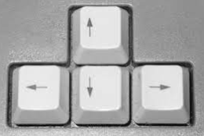
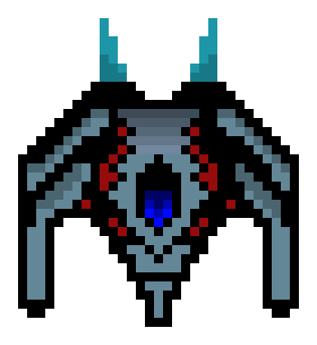
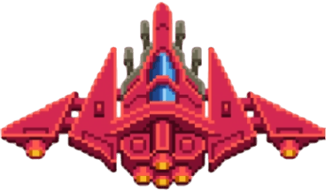
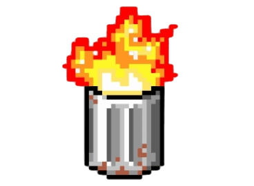
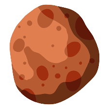
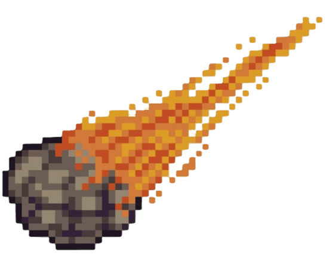

# Un juego con un nombre muy bonito 😀


### Repositorio

-   [click para ir al repo](https://github.com/bsquiroz/Spaceship-Game-CO-6-2023.git)

<details>
    <summary>
        Como instalarlo y comenzar a jugar
    </summary>
    
## Importante, deberas tener python instalado en tu computador

-   Copiar esta linea de codigo

```
git clone https://github.com/bsquiroz/Spaceship-Game-CO-6-2023.git
```

    Esto te creara una carpeta con este nombre _Spaceship-Game-CO-6-2023_

-   Ejecutaras las siguientes lineas de codigo

<details>
    <summary>Linux y mac aplica para consola con git bash</summary>

### linux y mac (git bash)

```
source env/Scripts/activate
```

#### Esto con el fin de activar el ambiente virtual

```
deactivate
```

#### Si lo que quieres es apagarlo

```
pip install -r requirement.txt
```

#### para instalar las dependencias necesarias para que corra el juego

```
py main.py
```

#### para jugar

</details>

<details>
    <summary>Windows</summary>

```
cd env
cd Scripts
activate
```

### Para activar el ambiente de desarrollo

```
cd ..
cd ..
```

### esto con el fin de que estes en el path de la carpeta |_Spaceship-Game-CO-6-2023_|

```
pip install requirements.txt
```

### Para instalar librerias y dependencias necesarias

```
py main.py
```

### Para comenzar a jugar

</details>

</details>

### De que trata el juego

El juego es sencillo, solo debes de sobrevivir a las incontables oleadas de enemigos que apareceran en tu juego. <br>
y al final de cada partida te mostrara que tan lejos has llegado y cuantos enemigos has aniquilado <br>
El juego consta de enemigos, obstaculos y poderes

### ¿Con que se juega?

| Teclas                                                                         | Descripcion                 |
| ------------------------------------------------------------------------------ | --------------------------- |
|  | Teclas de movimiento        |
| Tecla espacio                                                                  | Tecla para disparar balas   |
| Tecla F                                                                        | Tecla para disparar misiles |

### Enemigos

-   Los podras destruir con balas y misiles

| Enemigo                                                                           | daño | vida | velocidad | Cada cuanto aparece?        |
| --------------------------------------------------------------------------------- | ---- | ---- | --------- | --------------------------- |
|  | 1    | 10   | 5         | Muy amenudo                 |
|  | 1    | 5    | 10        | Muy amenudo                 |
|     | 1    | 50   | 15        | Cada que aniquiles 10 naves |

### Obstaculos

-   No podras destruirlos, entonces no los intentes, son obstaculos, esquivalos

| Obstaculo                                                                              | daño | Velocidad |
| -------------------------------------------------------------------------------------- | ---- | --------- |
|     | 1    | 10        |
|  | 2    | 10        |
|     | 3    | 15        |

### Poderes

-   Cogelos y usalos, aparecen muy amenudo, aprovecha

| Poder                                                                               | secuencia de aparicion | Que hace?                              |
| ----------------------------------------------------------------------------------- | ---------------------- | -------------------------------------- |
|  | Aleatorio              | Te otorga una vida                     |
|   | Aleatorio              | Te otorga un misil que hace 10 de daño |
|     | Aleatorio              | Te da inmunidad por 5 segundos         |

## Y por ultimo no jueguen mucho, mejor estudiente y tomen mucha agua, llegaran lejos, a menos de que transmitan por twitch sus juegos y la gente los apoye y se hagan ricos, pero no es probable, asi que estudien y mucha actividad fisica para que puedan jugar con sus nietos.
